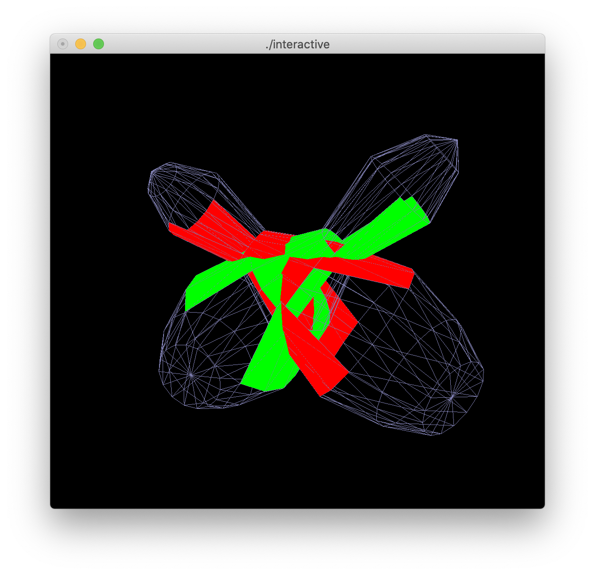
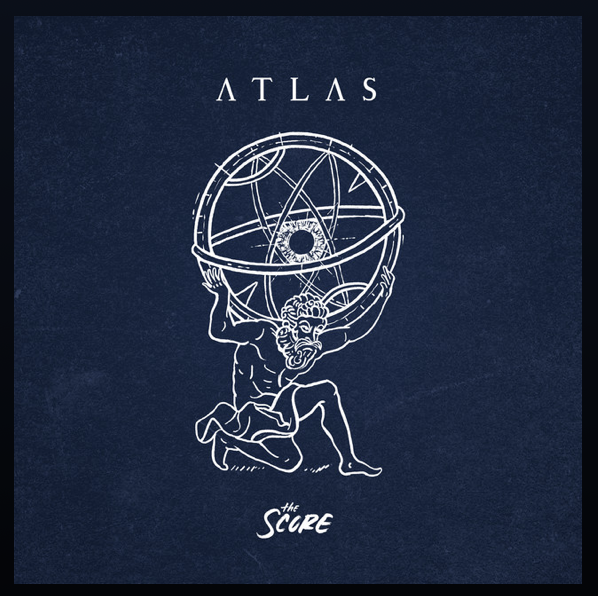
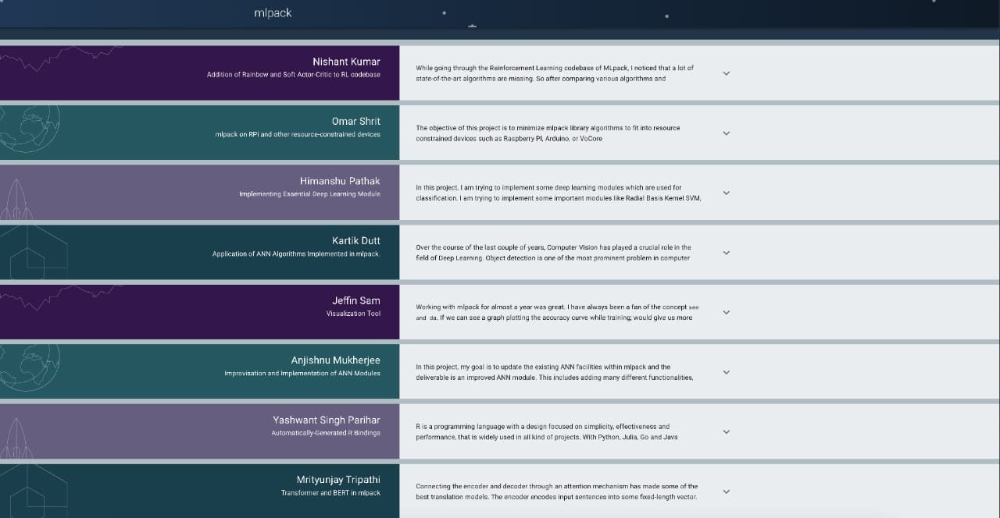

> Getting in is easier than getting out, they say.

I had applied for the Google Summer of Code program for 2020. With nearly a
thousand lines of contribution to [mlpack's source code](https://github.com/mlpack/mlpack)
and with a proposal nothing short of a miniature theses, I knew deep down I had
done my part. Now, I just needed Lady Luck to do hers.

When you have put in whole-hearted efforts into something, you will always end
up worrying about what the final outcome looks like. For me, this meant waiting
till 1800 hours UTC, which translates to around midnight in my timezone.

The morning of Judgement Day was as per usual. Wake up at 5 am, when all of my
peers are just going to bed, make some coffee and go into a code sprint till
about noon. That day I was working on a cool project, which I won't be
describing in details in this post, but here is a picture to give you a glimpse
at it.

The afternoon was pretty uneventful and some Battle Royale games did their part
in keeping me distracted from focusing on the impending doom. Also watched a
Netflix movie, starring Chris Hemsworth. Pretty much have a man-crush on the
dude from his Thor days, so that was exciting.

Go watch. You'll like it. Not sponsored, lol.

And I still had a couple of hours left before 1800 hours UTC. This felt the
longest I had ever had to wait for anything, but the wait was worth it. I
skipped dinner and sat down with a pack of chocolates to nibble my time away.
Refreshing the page every 5 minutes was certainly not good for the anxiety that
was building up, but I did it anyway, because YOLO. The clock was ticking slower
than ever, WhatsApp messages asking about the results were piling up, I could
see 3 missed calls on the lock screen from a distance, but it seemed like my
hands were glued to Cmd+R and the trackpad. With half an hour left on the clock,
it seemed like the results won't be declared before I completely freaked out.
Spotify helped a lot during this final phase. Turns out, if you listen to random
new songs when you are thinking about something, you end up focusing on the
lyrics after some time and forget what you were thinking about in the first
place.

This was a nice song I listened to during this period.

I had zero idea that the results would also be announced via email. I had a
couple of friends who had applied for other projects. When the rejection emails
started reaching some of them around 5 minutes before the deadline and my inbox
still only had emails that I send myself, my first reaction was *"I messed
up so bad they won't even send an email to reject me."* 3 minutes left on the
clock now. Now, I was refreshing GMail in one tab and the other page in a
separate one, feeling like a Refresh Jedi, staying true to the spirit of the
day. Then suddenly 2 minutes prior to the deadline, my inbox had a new email.
The headline was all I needed to see.

> GSoC 2020: Congratulations, your proposal with mlpack has been accepted!

I felt a rush of emotions (obviously, duh) but the funniest one I can recall was
being disappointed that the results came through to me 2 minutes before the
scheduled time. Felt kind of anticlimactic, idk.

The 8 people who were selected to work with mlpack this year as part of GSoC.

My parents had the best reaction that I recall from that day. Don't worry Mom,
still love you!

> **Me :** I got selected for GSoC.  
> **Them :** Oh nice! What's GSoC though?

Half an hour of replying back to people later, it was time to go to bed. I had
an early meeting scheduled for the next day.

There you have it. GSoC-getting selected, a story of anxiety, POV me. Someone
had to tell the truth, we can go into the sugar-coated blogs later on in this
series. Speaking of sugar, did you see the cute picture on the blog card for
this post?
