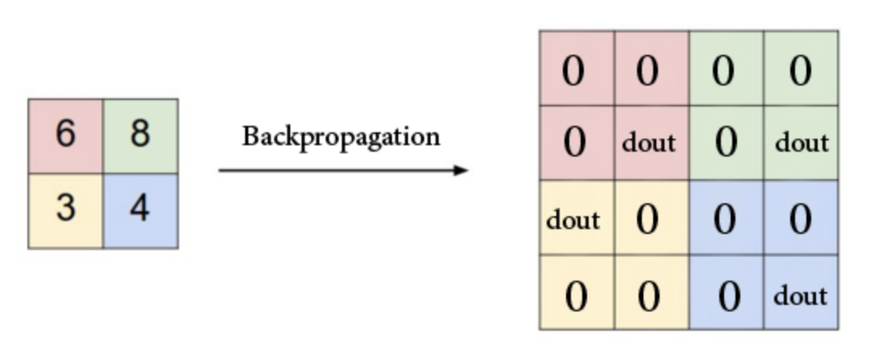

> Let's light this candle.

Cyclone Amphan made landfall in my city on the 21st of May. Even though we are
lucky enough to be far away from the coast and thus only see about half of the
maximum strength of the cyclone, it was still the worst we have seen in the last
20 years or so. And that is a major statement, given that we see a couple of
cyclones every year during this period.

I still don't have a very stable internet connection and that has made working
on the project slightly more difficult for me. But I figured out one way I could
stay productive was to download the armadillo and PyTorch docs, so that I can
go through stuff offline while trying to figure out the flow of the source code.
The following is the command I used for this purpose.
```
wget --mirror --convert-links --adjust-extension --page-requisites
     --no-parent http://arma.sourceforge.net/docs.html
```

Now coming to the project I will be doing across the next 3 months or so, it is
titled _**Improvisation and Implementation of ANN Modules**_. The idea is that
the ANN module of mlpack which is quite good at its current state is lacking in
some features that would allow more user flexibility, more widespread adoption
and hopefully also more usability. I will be adding some new features to the
module and improving some of the existing features.

One of the first things that I am looking to implement is a Unpooling layer.
We already have a maxpooling layer in mlpack, which has to implement unpooling
as part of the backpropagation through the layer.

<div align="center">

<p></p>
</div>

Unpooling as a standalone layer would do the exact opposite of maxpooling. So,
basically the forward function of Unpool would resemble the backward for
maxpool. My main task in this week has been to understand the forward and
backward functions of maxpool and figure out how to invert them correctly to
work in the separate layer. Print statements have been very useful in this
regard :)

Apart from implementing the unpooling layer, I figured I would need to add some
accessor methods to the existing maxpool layer to get the pooling indices,
because from the pseudo-code I have curently for the Unpool layer, I would need
to pass in indices as a input parameter. This design would also follow the
format of the equivalent PyTorch implementation of the layer and is thus
expected to be user-friendly. I will add these accessors in a PR very soon, once
I have the Unpool layer completely figured out and working locally.

Also, understanding the maxpooling layer gave me some insight for the next
feature that I will be implementing after UnPooling layer, which is the Lp
Pooling layer. I grouped these 2 together, because it felt like it would save
time as they are related topics.

Now, coming to the fun part of this blog. I mentioned during the introductory
meet on IRC, that I will be suggesting some songs throughout the summer and then
at the end, I will put all of them in a Spotify playlist for easier access.
Here's the first song in the series.

<div align="center">

<p><b><i>Man Up</i></b> by <b>Hailee Steinfeld</b></p>
</div>

Another interesting thing happened this week. An issue I created in
[torchdata](https://github.com/szymonmaszke/torchdata) (which is a useful helper
library for writing data loaders in PyTorch) got the author of the library to
finally shrug off some dust and release a new minor version which removes
unnecessary dependencies on Python versions and thereby allows the library to be
used in Google Colab easily.

Also, watching a spaceship launch live, is probably one of the most
breath-taking moments ever. I am so glad they made it up safe!

Until next time!<br>
XOXO