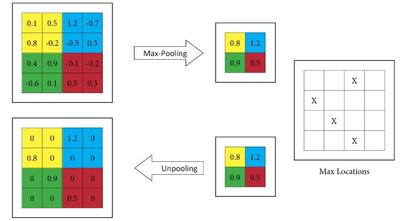

> I got your backs... just, you know, from the front.

A new FPS game from Riot Games was released a few days back and the gaming
communities are going gaga over Valorant. The quote above is from one of the
fan-favorite agents in the game, named Jett (she is also the one in the blog
card for this post). I have spent some time playing this new game and it has
been decently enjoyable to say the least. To be exact this game is the
combination of CS 1.6 and OverWatch, with all the agent abilities and the high
movement inaccuracy with randomized spray patterns. The game is still sort of in
a developing phase, I feel, because the characters and maps could definitely
improve in some areas like graphics and also tactical sturdiness. But, it is fun
to play nonetheless.

<div align="center">

<p></p>
</div>

Now coming to the work done this week. Let's start of with where I left last
time. The UnPool layer. Consider that you have a ```4x4``` feature map, over
which you apply a ```2x2``` maxpooling operation. The order of operations that
will be executed during pooling in mlpack can be seen from the gif below.

<div align="center">

<p></p>
</div>

Once these operations are complete, we will have a 2x2 reduced feature map and
also 4 values of pooling indices. Both of these are required by the UnPooling
layer to calculate its output. The steps can be visualized as below.

<div align="center">

<p></p>
</div>

Currently, in mlpack there is no way to access
the pooling Indices and so I opened an
[issue](https://github.com/mlpack/mlpack/issues/2439) to facilitate discussion
on this matter. But we haven't reached any solid conclusions so far. I have
completed a mock demonstration of the code for UnPool locally, but there is no
meaning of pushing it till the issue above is resolved.

Another thing that I worked on during this week was the implementation of the
Soft Margin Loss function.

<div align="center">
<p float="left">
  
</p>
<p></p>
</div>

The implementation of this function was pretty straightforward and writing the
backward method was only a very simple differentiation away.

> Forward method

<div align="center">

<p></p>
</div>

> Differentiation for Backward method (calculation of dL/dx)

<div align="center">

<p></p>
</div>

Another feature I was working on was introducing reduction facility for Loss
functions in mlpack. However, to do this I first needed to verify the loss
functions first and see if they were correctly implemented. While doing that I
ran into an unexpected issue. Some of the loss functions are not correctly
implemented or don't work as expected. I have opened an
[issue](https://github.com/mlpack/mlpack/issues/2444) for listing all
these errors in one place, while simultaneously working out the correct
implementations locally. The work with these portions will be part of a major
change in the loss functions folder which I hope to complete and push in the
coming weeks.

Coming to music recommendations for the week, I have been listening to a mix of
songs, all of which are really good. But, here is one that has really stuck to
me for the last couple of days or so. Maybe its because the mood of that song
resonates with the general theme of protests going on everywhere. #BLM

<div align="center">

<p><b><i>Slide</i></b> by <b>M.I.M.E, Drama B and BULGANG</b></p>
</div>

See you next week!<br>
XOXO
