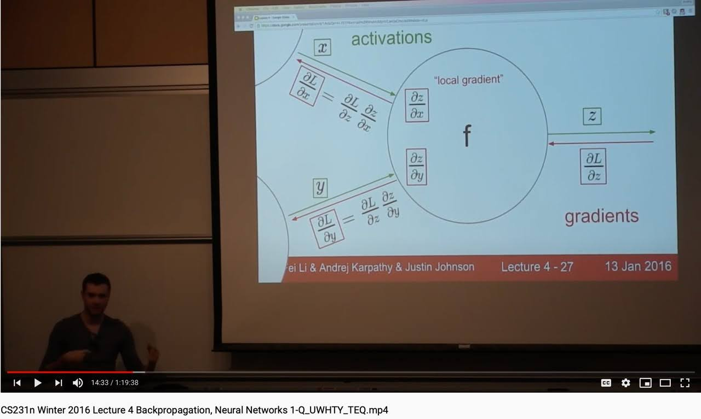

> What I cannot create, I do not understand.

Remember last week, when I talked about this
[issue](https://github.com/mlpack/mlpack/issues/2444) in mlpack? Yeah, the list
has grown pretty big since then. This week was spent debugging the loss
functions in mlpack and in the process getting a clearer understanding of
backpropagation along with some powerful features of PyTorch.

Till now I have gone through almost all of the loss functions and only have a
couple left to check. But, the scary part is that I have managed to find bugs in
7 different loss functions so far. Some of the bugs are pretty minor, because
they would either cause compiler warnings or don't exactly specify the nature of
inputs expected from the user and are thus prone to errors during use in neural
networks. However, most of the bugs I found are basically saying that the entire
loss function is incorrectly computed. Either the Forward method implements the
formula for the loss function incorrectly or the Backward method doesn't
calculate the gradients correctly or in some cases the implementation of the
loss function gets meddled up with the implementation of reduction facilities
and calculates the entire thing incorrectly in the end.

The approach that I am going for to solve these bugs is primarily to standardise
the implementation across all functions. The template I have used so far for
everything is shown below. I have verified several loss functions using this
method and compared them with results from PyTorch to further prove correctness.
Google Colaboratory notebooks for all these experiments are available in the
first comment in the issue which I mentioned earlier at the start.



  // Forward
  arma::mat loss_none = // translation of the basic formula of the function
  double loss_sum = arma::accu(loss_none);
  double loss_mean = loss_sum / input.n_elem;

  // Backward
  if (reduction=="none" || reduction=="sum")
    output = // dL/dx
  else // reduction = "mean"
    output = output / input.n_elem



Currently every loss function has a Forward method which has the return type
equal to the element type of the input. So, considering the code above, the
return type of any_loss_function.Forward() is ***double***. But, if I wanted to
implement none reduction, I need to return an armadillo matrix of type
InputType. The calculation shown above for ```loss_none``` can simply be cached
in a private class variable for each class. But the problem lies in how I can
return it to the user. We can't directly overload by return type in C++ while
keeping the function signature completely the same.

- One way out is to update the template type for the Forward() method for all
  loss functions to always return a matrix (if reduction is applied, we can
  simply return a 1x1 matrix instead of returning a scalar), but I am not sure
  if that design would be suitable for mlpack, given the fact that these loss
  functions are not standalone classes but they have to fit into a neural
  network and thus need to work along with existing code.

- Another method would be to not change the return type of the Forward method,
  but only allow the user access to the  private ```loss_none``` matrix via a accessor
  method. But, this approach defeats the whole purpose of having none-type
  reduction for a loss function as ideally the user should be able to pass in
  none as the reduction parameter in the constructor and then get the
  non-reduced matrix as output on calling Forward().

- Maybe we can come up with some solution involving templates or some other
  method. Or maybe there is a much easier method that I am missing (?)
  Will need to discuss this with other contributors at mlpack and see if we can
  come up with a solution to this problem.

Anyway, the conclusion is that apart from being left to figure out how to return
the matrix for none type reduction, I have debugged almost all of the loss
functions in mlpack except two, which I will be completing in the coming week.

Another issue that I faced this week related to this is with debugging
of the Margin Ranking Loss function. The Forward method of that function is
correct, even though it only does mean reduction. I added the other reduction
types and now the Forward() is complete. When talking about the Backward()
method of the function, I discovered a bug which I don't know how to solve. As
far as I understand, solving it is not currently possible in mlpack. Let me
explain.

<div align="center">

<p></p>
</div>

This image from this YouTube [video](https://youtu.be/GZTvxoSHZIo)
shows how backprop works for a function with 2 inputs and 1 output.
Considering the function in the figure to be a loss function, we would get dL/dz
= 1 as z = L for the loss function. So, basically the upstream derivative is
just unity. In terms of mlpack, **gy = 1**. So, to calculate gx, which is the
derivative that will be pased to prior layers in the network, we just need to
calculate dL / d(input) for loss functions in mlpack, i.e., **g = dL / d(input)**
. But this particular loss function poses a challenge, because it has 2 inputs.
The current implementation is incorrect, because it calculates dL / d(target),
which is meaningless. But if we try to think of the correct implementation, we
would quickly get stuck, because here, the input is not just one matrix, but 2
matrices, input1 and input2. These 2 matrices have been passed together as one
single matrix in the input variable by stacking them one on top of another, so
as to match the function signature of Forward() as implemented throughout the
code base.

<div align="center">

<p>Two (1,3) matrices are stacked to get a (2,3) input.</p>
</div>

However, for all calculation purposes, this hacked together input has to be
effectively unpacked into its 2 constituent inputs and only then can the
calculations for the loss function be performed. So, effectively this loss
function has 2 inputs. Now, that this idea is established, we can clearly see
from the image for backpropagation above, that instead of just dL/dx, we need to
calculate dL / dx1 and dL / dx2, because each input has a different effect on
the output of the loss function and hence the gradients backpropagated through
them will obviously be different. So, for the Backward() method, if we try to
apply a similar hack as in the Forward() method and just pack the matrices for
dL / dx1 and dL / dx2 into one single matrix as dL / dx, that is not the correct
solution. So, the Backward() method needs to return 2 separate outputs. The
pseudo-code for this idea would need to look somewhat like the following.

```cpp
  Backward(input, target, output1, output2){

    // first unpack x(input) into x1(input1) and x2(input2)
    input1 = input.rows(0, inputRows / 2 - 1);
    input2 = input.rows(inputRows / 2, inputRows - 1);

    // then calculate the 2 gradients separately for each input.
    output1 = // dL / dinput1
    output2 = // dL / dinput2
  }
```

As far as I understand, this isn't currently possible. Maybe we need to
implement some custom layer or something and then declare this loss function to
be to that type to achieve this implementation. But, as of now, this loss
function is incorrect and can't be directly corrected using existing function
signatures. Also, I have no clue on how this can be corrected. I will be
creating a separate issue for this function in the coming week and would love to
hear about ideas on how we go about accomodating this in mlpack. But, one thing
I would like to note is that, since this isn't directly part of my proposed list
of deliverables for GSoC, correcting this particular loss function isn't on top
of my priority list if that means a lot of extra work, because then I won't be
able to stick to my already tight schedule for the other features that I have to
implement across the summer. So, if there is no hotfix available for this, the
function will be mentioned as a good-first-issue for anyone interested to take
it up in the meanwhile, or I can work on it after my proposed work for GSoC is
complete.

That concludes all the work that I have done in this week.
Now, coming to song recommendations for the week. I know I have already shared a
Hailee Steinfeld in Week Zero, but I couldn't vote another song past this one
for this week. Guess I am becoming a Hailee fan, or was I already one before? 🤭

<div align="center">

<p><b><i>Masterpiece</i></b> by <b>Hailee Steinfeld</b></p>
</div>

That's all for now! This was a lengthy one :) <br>
See you next week!<br>
XOXO
