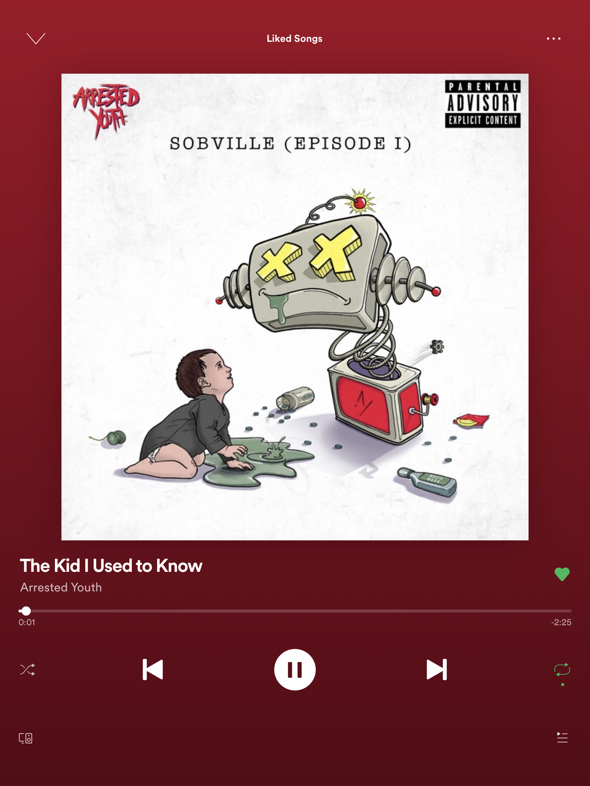

Wanderlust 🥺 | Teamlab Borderless Museum by <a href="https://unsplash.com/@paradoxis?utm_source=unsplash&amp;utm_medium=referral&amp;utm_content=creditCopyText">Luke Paris</a> on <a href="https://unsplash.com/t/technology?utm_source=unsplash&amp;utm_medium=referral&amp;utm_content=creditCopyText">Unsplash</a>

I had multiple exams this week at my university along with some hard final
deadlines for assignments and stuff. So, I couldn't actually post this blog on
time, however, I am still writing it later on as a week3 blog, so as not to
disturb the continuity.

This week, my major contributions included working towards correcting the
remaining loss functions in mlpack. I finished writing demo notebooks to compare
the new implementations with the PyTorch implementation. All the notebooks are
available in a demo repository that I am maintaining
[here](https://github.com/iamshnoo/mlpack-testing/tree/master/loss_functions).
I believe this notebook based approach towards features that share similar
behaviour with other popular libraries would help not only towards a more robust
review process and also towards beginner adoption of the library for common
tasks involving the ANN module. There was an official mlpack meeting this week,
which I missed because I had an exam early the next day. However, I had informed
my mentor previously about the issues with the loss functions. And he raised the
point during the meeting on my behalf about having a stricter review process in
the future to have fewer possible bugs, with my Google Colab notebook based
approach that I am taking, being suggested as a possible alternative.

One cool thing that happened during this week. I  noticed that a lot of people
cloned my demo repository for the new mlpack features that I am working on
during the last two weeks. That was a major feel-good factor for me.

Not much happened other than that for this week. So, coming to the end of this
blog, here is the song for the week.

<b><i>The Kid I Used to Know</i></b> by <b>Arrested Youth</b>

See you next week! 
XOXO
