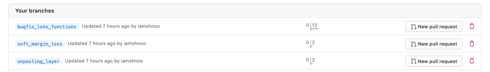
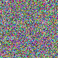
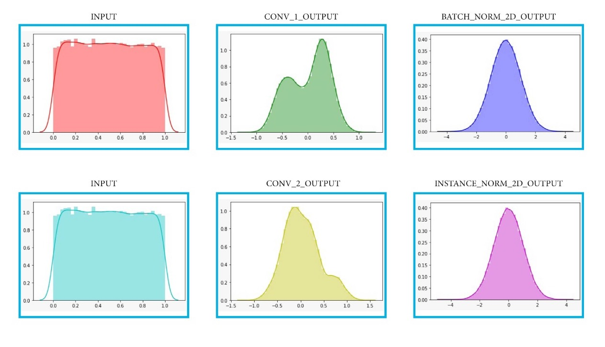
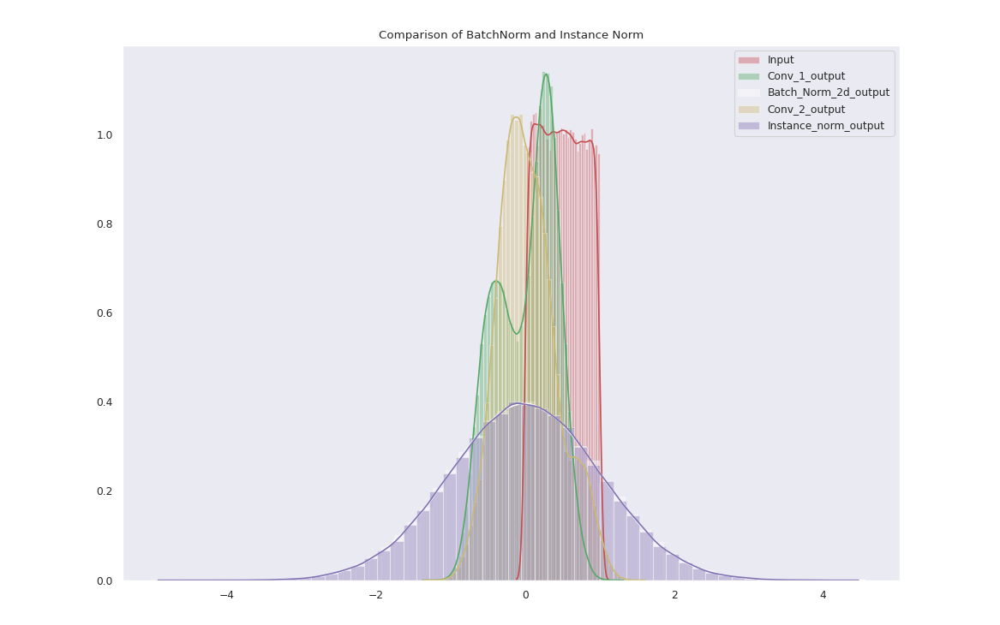
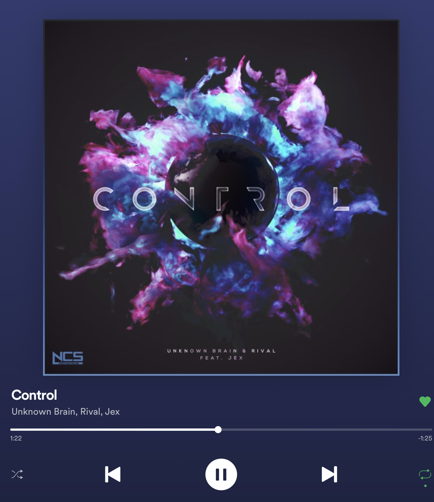

Pretty 🙆🏻 UwU  |  Flowers on a white table by <a
href="https://unsplash.com/@wendish?utm_source=unsplash&amp;utm_medium=referral&amp;utm_content=creditCopyText">Victoria
Wendish</a> on <a
href="https://unsplash.com/?utm_source=unsplash&amp;utm_medium=referral&amp;utm_content=creditCopyText">Unsplash</a>

The exams continued this week, till the 29th. It went well for the most part,
except maybe one particular exam. Because I was busy preparing for that, I got
delayed writing this blog by a couple of days. But anyway, now that I am here,
let's get started.

Primarily, in this week, I completed the formalisation of all the demo features
that I had worked on throughout the first month of coding period of GSoC. What
that means is basically that I now not only have a separate repository with
complete demos of each of the features, but I have also created 3 different
branches corresponding to each feature and committed to my
[fork](https://github.com/iamshnoo/mlpack) all the 1242 lines of code
that I want to add. I will be creating PRs for each branch before the evaluation
deadline on Friday, 3rd July so that the code can be reviewed by other members.
I haven't created PRs yet, simply because of the persistent issues with the
build failures that are happening across different branches, and I wanted to
wait till those are fixed.  I have discussed some of the issues with my mentor
via IRC, that solved some of the problems I had.
But, I still have 2 open issues, namely
[#2439](https://github.com/mlpack/mlpack/issues/2439) and
[#2444](https://github.com/mlpack/mlpack/issues/2444), which would need some
more extended discussions before I can integrate some changes to get the entire
code working for the Unpooling layer and also some opinions would obviously be
required about the re-design of the ANN loss functions module that I would be
presenting. Because of the possibility of extended discussion involved, I am not
entirely sure whether they would get merged before the coding period ends. But,
atleast from my side, they are mostly ready and require only minor change
possibly, which I expect won't interfere when I start working on other features
during the next month of the coding period.

Apart from this, I spent some time on understanding the difference between the
Instance Norm and Batch Norm layers of PyTorch. Some of the experiments I tried
out can be seen from
[this Google Colab notebook](https://colab.research.google.com/drive/1RrBy8GD4rSqbPhVaVPItKQyAIL0cTOwI?usp=sharing).

I am including some images below to illustrate one of the important conclusions I
reached. For a single randomly generated image, Instance Normalisation works as
good as Batch Norm, with very minor performance improvements. Effectively, both
of them are able to generate nearly perfect Gaussian normal distributions of
pixel values.

First, I take a randomly generated image.

Then I pass that image through a Conv-Norm layer combination.

For perspective, this is what they look like when plotted together.  
Batch Norm (white) is almost perfectly eclipsed by Instance Norm (magenta).

These results helped me verify the mathematical formulae in the paper, because
from the formula for each of the normalisations, it can be clearly seen that it
is expected that the results of the 2 normalisations are supposed to be very
similar. The Instance Norm layer is primarily useful for specific tasks like
image generation and possibly even image discrimination as discussed in
[this](https://arxiv.org/pdf/1607.08022.pdf) paper.

I will start working on the Forward() method of this normalisation layer in the
next week, and once that is completed I would move on towards understanding and
implementing the Backward() method.

With that, I am done discussing all the stuff I did this week.
Coming to song recommendations for the week, here is one that I have been
listening to a lot lately.

<b><i>Control</i></b> by <b>Unknown Brain & Rival ft. Jex</b>

See you next week! 
XOXO
