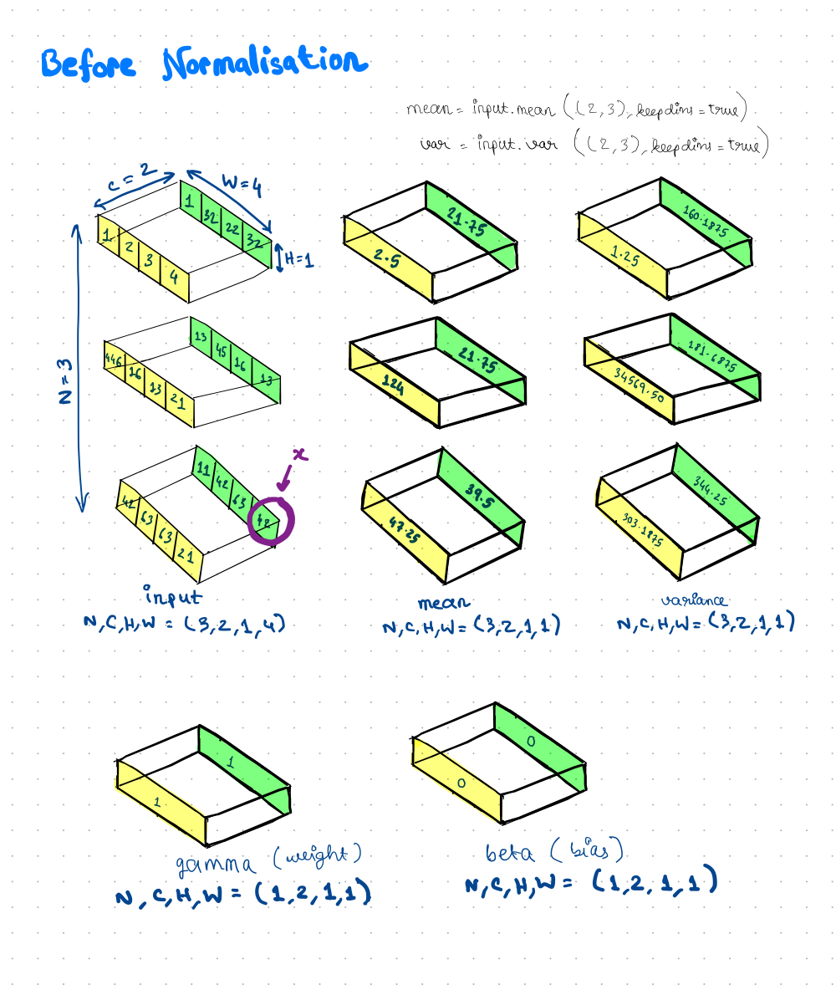
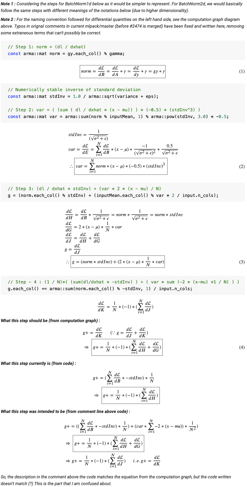
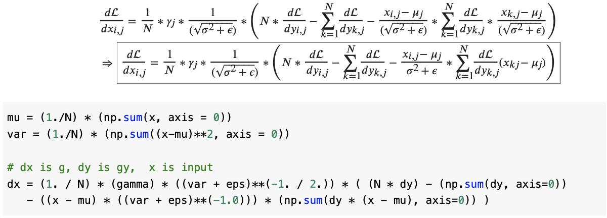
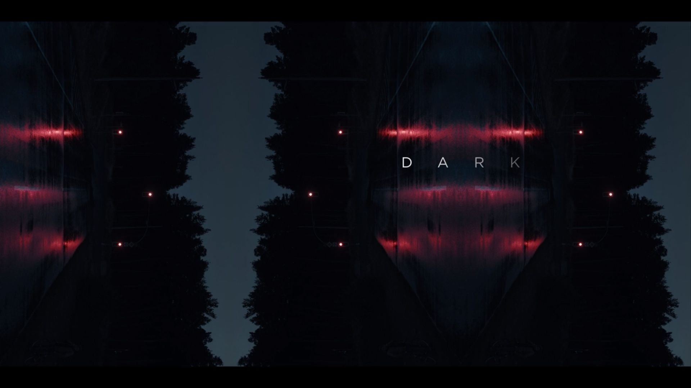

<i>It's all just differentiation.</i>

This week, I mainly worked on the Instance Norm layer. By default, this meant
taking a look at the BatchNorm layer. Until recently, mlpack supported the
equivalent of BatchNorm1d of PyTorch. But, there wasn't support for a
BatchNorm2d equivalent. One of the other students working on a GSoC project that
involved creating a DarkNet model thus hit a roadblock.
[PR #2474](https://github.com/mlpack/mlpack/pull/2474) was created in response
to support the BatchNorm operation after Convolutional layers.
That was very helpful towards me making some progress with my feature for the
Instance Norm.

Currently, I am completely done with implementation of the ***Forward()***
method and the results from my implementation match completely with the PyTorch
implementation of the layer for all the test cases I have tried. Here is a cool
4D diagram which I have tried to represent on a 2D surface, to explain how the
mean and variance calculations are done for InstanceNorm.

The ***Gradient()*** method of Instance Norm will basically be an exact replica
of the method of the same name for BatchNorm. So, there isn't much to discuss
about that.

For the ***Backward()*** method, I tried my best to understand backprop for
BatchNorm, by deriving equations from the computation graph of the function
(see first fig) and then mapping them to the mlpack implementation.
However, I am not completely convinced about one particular step followed in the
mlpack calculations, and so I need to verify this a bit more before I modify the
functionality accordingly to work for the Instance Norm layer. The image below
explains the mapping of the equations derived from the computation graph to the
code for BatchNorm currently in mlpack/master, and also the part where I have a
bit of a doubt about the correctness of the implementation. I have currently
asked my mentor about this, and based on the feedback I receive, I might need to
open an issue or add a comment in #2474.

The other concern I have regarding the current implementation of the
***Backward()*** method is that it takes the lengthier approach of using the 4
equations of backprop obtained from the computation graph. If we work out the
equations of the derivatives manually instead, then we get a single expression,
which is more compact and will possibly run much faster. For example, the numpy
implementation of this compact representation can run upto about ***5x*** faster
than the computation graph based approach. Maybe we should try this at some
point in time later on? After all, mlpack is known for being fast and it never
hurts to be faster :)

Phew! That was intense. This has been one of the most exciting weeks so far,
because of all the maths stuff involved, which I really enjoyed figuring out.

I watched a very different kind of movie (as compared to what I usually watch)
this week (a friend recommended this). If you are into history and you love
musicals, I recommend checking out the movie Hamilton(2020). Even if you aren't
really into this genre, the quality of the video and the acts will definitely
amaze you.

I also managed to sneak in a few episodes of the currently raging popular
Netflix series, Dark. If time-travel and mystery interest you, I bet this series
will intrigue you with its complicated timelines and plots.

Coming to song recommendations for the week, here is one that I have been
listening to a lot lately.

<b><i>Lose Somebody</i></b> by <b>Kygo & One Republic</b>

See you next week! 
XOXO
